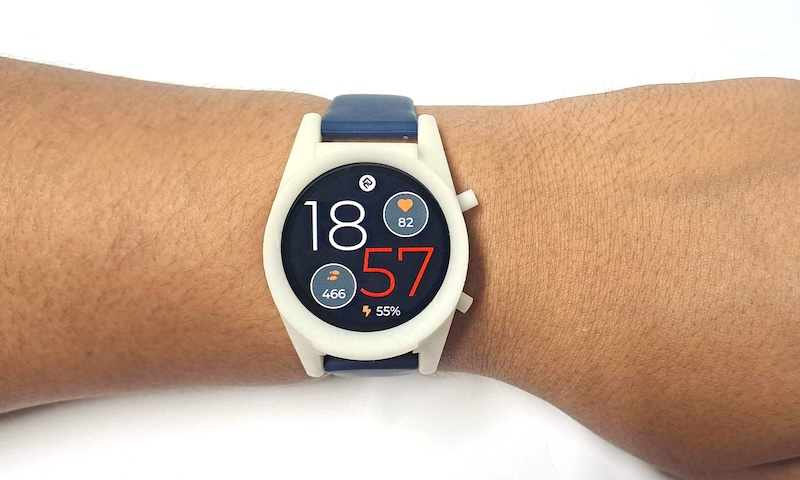
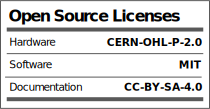

<div align="center">
  


</div>

# HealthyPi Move Firmware 

This repository contains the firmware for the HealthyPi Move device. The firmware is based on the [Zephyr RTOS](https://www.zephyrproject.org/). 

HealthyPi Move is an open hardware device that lets you track all your vital signs to a high degree of accuracy. But it’s not just another smartwatch with a heart rate monitor. It is a complete vital signs monitoring and recording device on your wrist that can measure electrocardiogram (ECG), photoplethysmogram (PPG), SpO₂, blood pressure (finger-based), EDA/GSR, heart rate variability (HRV), respiration rate, and even body temperature.



The hardware files for the HealthyPi Move are available at their own repository - [HealthyPi Move Hardare](https://github.com/Protocentral/healthypi-move-hw)

HealthyPi Move is now available for pre-order in the ongoing campaign on [Crowd Supply](https://www.crowdsupply.com/protocentral/healthypi-move)

## Repository Contents

* **/app** - Main Application Code for the HealthyPi Move device
* **/drivers** - Device drivers for onboard devices
* **/boards** - Boards definition devicetree files
* **/scripts** - Convenience scripts 

## Compiling the firmware

Do not use the "Code" button to download the zip file, as it will not include the Zephyr submodules correctly.

For a quick start, you can use the following steps to compile the firmware :

```
west init -m https://github.com/protocentral/healthypi-move-fw --mr main healthypi-move-workspace
cd healthypi-move-workspace
west update
```

You can then build the firmware by running the following commands.

```
west build -b healthypi_move_nrf5340_cpuapp application/app
west flash
```

You can also open the project in Visual Studio Code and use the nRF Connect extension to open the project and build the firmware from there. This will ensure that you have all the required tools installed. For more about installing the nRF Connect extension, please refer to [Nordic's Documentation](https://docs.nordicsemi.com/bundle/ncs-latest/page/nrf/installation/install_ncs.html).

## License Information



This product is open source! Both, our hardware and software are open source and licensed under the following licenses:

Hardware
---------

**All hardware is released under the [CERN-OHL-P v2](https://ohwr.org/cern_ohl_p_v2.txt)** license.

Copyright CERN 2020.

This source describes Open Hardware and is licensed under the CERN-OHL-P v2.

You may redistribute and modify this documentation and make products
using it under the terms of the CERN-OHL-P v2 (https:/cern.ch/cern-ohl).
This documentation is distributed WITHOUT ANY EXPRESS OR IMPLIED
WARRANTY, INCLUDING OF MERCHANTABILITY, SATISFACTORY QUALITY
AND FITNESS FOR A PARTICULAR PURPOSE. Please see the CERN-OHL-P v2
for applicable conditions

Software
--------

**All software is released under the MIT License(http://opensource.org/licenses/MIT).**

THE SOFTWARE IS PROVIDED "AS IS", WITHOUT WARRANTY OF ANY KIND, EXPRESS OR IMPLIED, INCLUDING BUT NOT LIMITED TO THE WARRANTIES OF MERCHANTABILITY, FITNESS FOR A PARTICULAR PURPOSE AND NONINFRINGEMENT. IN NO EVENT SHALL THE AUTHORS OR COPYRIGHT HOLDERS BE LIABLE FOR ANY CLAIM, DAMAGES OR OTHER LIABILITY, WHETHER IN AN ACTION OF CONTRACT, TORT OR OTHERWISE, ARISING FROM, OUT OF OR IN CONNECTION WITH THE SOFTWARE OR THE USE OR OTHER DEALINGS IN THE SOFTWARE.

Documentation
-------------
**All documentation is released under [Creative Commons Share-alike 4.0 International](http://creativecommons.org/licenses/by-sa/4.0/).**


You are free to:

* Share — copy and redistribute the material in any medium or format
* Adapt — remix, transform, and build upon the material for any purpose, even commercially.
The licensor cannot revoke these freedoms as long as you follow the license terms.

Under the following terms:

* Attribution — You must give appropriate credit, provide a link to the license, and indicate if changes were made. You may do so in any reasonable manner, but not in any way that suggests the licensor endorses you or your use.
* ShareAlike — If you remix, transform, or build upon the material, you must distribute your contributions under the same license as the original.

Please check [*LICENSE.md*](LICENSE.md) for detailed license descriptions.