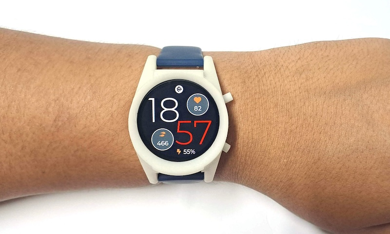
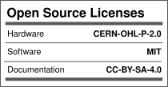

<div align="center">
  


</div>

# HealthyPi Move Firmware

[](https://github.com/protocentral/healthypi-move-fw/actions/workflows/ci.yml) 

This repository contains the firmware for the HealthyPi Move device. The firmware is based on the [Zephyr RTOS](https://www.zephyrproject.org/). 

HealthyPi Move is an open hardware device that lets you track all your vital signs to a high degree of accuracy. But it’s not just another smartwatch with a heart rate monitor. It is a complete vital signs monitoring and recording device on your wrist that can measure electrocardiogram (ECG), photoplethysmogram (PPG), SpO₂, blood pressure (finger-based), EDA/GSR, heart rate variability (HRV), respiration rate, and even body temperature.



The hardware files for the HealthyPi Move are available at their own repository - [HealthyPi Move Hardare](https://github.com/Protocentral/healthypi-move-hw)

HealthyPi Move is now available for pre-order in the ongoing campaign on [Crowd Supply](https://www.crowdsupply.com/protocentral/healthypi-move)

## Repository Contents

* **/app** - Main application code for the HealthyPi Move device
* **/drivers** - Custom device drivers for onboard sensors (MAX30001, MAX32664C/D, BMI323, etc.)
* **/boards** - Board definition files and device tree configurations
* **/scripts** - Build and flash convenience scripts
* **/docs** - Documentation and design notes

## Features

- **Vital Signs Monitoring**: ECG, PPG, SpO₂, Heart Rate, HRV, Respiration Rate, Body Temperature
- **Blood Pressure**: Finger-based blood pressure estimation with calibration
- **Activity Tracking**: Step counting, activity recognition via 6-axis IMU
- **Galvanic Skin Response (GSR)**: Stress and EDA measurement
- **Health store**: Typed samples + episodic records on LittleFS; phone sync via **MCUmgr `HPI_HS`** (group `0x1000`) — see [Health data sync (HPI_HS)](#health-data-sync-hpi_hs) and `docs/HPI_HS_API.md`
- **Bluetooth LE**: Real-time GATT streaming (HR, SpO₂, temp, ECG/PPG/GSR waveforms) plus MCUmgr (DFU, datetime, `HPI_HS`)
- **DFU Support**: Over-the-air firmware updates via MCUboot (images must be signed with the published keys in `app/keys/` — see [Firmware signing keys](#firmware-signing-keys-required-for-dfu))
- **Power Management**: Battery monitoring and optimized sleep modes
- **LVGL UI**: Modern touch-enabled display interface

## Getting Started

### Prerequisites

You need to have the Zephyr development environment set up. The recommended approach is to use the [nRF Connect SDK](https://www.nordicsemi.com/Products/Development-software/nrf-connect-sdk) which includes Zephyr and all required tools.

**Recommended: Install nRF Connect SDK with VS Code**

Follow the official [nRF Connect SDK Installation Guide](https://docs.nordicsemi.com/bundle/ncs-latest/page/nrf/installation/install_ncs.html):

1. **Install Visual Studio Code**
   - Download and install [VS Code](https://code.visualstudio.com/)

2. **Install nRF Connect for VS Code Extension**
   - Open VS Code
   - Go to Extensions (Ctrl+Shift+X / Cmd+Shift+X)
   - Search for "nRF Connect for VS Code"
   - Install the extension

3. **Install Toolchain via nRF Connect Extension**
   - Click the nRF Connect icon in VS Code sidebar
   - Go to "Welcome" view
   - Click "Install Toolchain"
   - Select the recommended version
   - The extension will automatically install:
     - nRF Connect SDK (includes Zephyr)
     - ARM GCC toolchain
     - CMake, Ninja, and other build tools
     - West meta-tool
     - Python dependencies

### Cloning the Repository

**⚠️ Important**: Do not use the "Code" → "Download ZIP" button, as it will not include the Zephyr submodules correctly.

Initialize the workspace using West:

```bash
# Initialize west workspace with this repository as the manifest
west init -m https://github.com/protocentral/healthypi-move-fw --mr main healthypi-move-workspace

# Navigate to the workspace
cd healthypi-move-workspace

# Fetch all Zephyr modules and dependencies (this may take several minutes)
west update
```

This will create the following structure:
```
healthypi-move-workspace/
├── healthypi-move-fw/        # This repository
├── zephyr/                   # Zephyr RTOS
├── modules/                  # Zephyr modules
├── bootloader/               # MCUBoot bootloader
└── tools/                    # Build tools
```

### Building the Firmware

#### Method 1: Visual Studio Code (Recommended)

1. Open VS Code
2. Ensure the **nRF Connect for VS Code** extension is installed (see Prerequisites)
3. Click on the nRF Connect icon in the sidebar
4. Click "Open an existing application"
5. Navigate to `healthypi-move-workspace/healthypi-move-fw/app`
6. Click "Add Build Configuration"
7. Select board: `healthypi_move_nrf5340_cpuapp`
8. Click the "Build" button in the Actions panel

The extension will automatically:
- Configure CMake with correct parameters
- Build the application firmware
- Build the bootloader (MCUBoot)
- Generate merged binaries and DFU packages

Build artifacts will be in `build/`:
- `build/zephyr/zephyr.hex` - Application firmware
- `build/zephyr/merged.hex` - Merged firmware (bootloader + app)
- `build/dfu_application.zip` - DFU package for OTA updates

#### Method 2: Command Line (Advanced)

```bash
# Build for HealthyPi Move board
west build -b healthypi_move_nrf5340_cpuapp healthypi-move-fw/app

# For a clean build (recommended after major changes)
west build -b healthypi_move_nrf5340_cpuapp healthypi-move-fw/app --pristine

# Build with board root specification (alternative)
west build healthypi-move-fw/app --board healthypi_move_nrf5340_cpuapp -- -DBOARD_ROOT=healthypi-move-fw
```

### Flashing the Firmware

#### Method 1: VS Code nRF Connect Extension (Recommended)

1. Connect your J-Link, nRF52840 DK, or other compatible programmer to the HealthyPi Move SWD port
2. In VS Code, open the nRF Connect extension sidebar
3. In the "Actions" panel, click the "Flash" button
4. The extension will automatically:
   - Detect your programmer
   - Program the QSPI flash configuration (on first flash)
   - Flash the merged firmware
   - Reset the device

#### Method 2: Command Line (Advanced)

```bash
# Flash via connected programmer (auto-detects J-Link, etc.)
west flash

# Flash only the application (faster during development)
west flash --softreset

# Flash with specific runner (if needed)
west flash --runner nrfjprog
```

### Verifying the Build

After flashing, the device should:
1. Show the boot splash screen
2. Initialize all sensors
3. Display the home screen with current time
4. Be discoverable via Bluetooth as "healthypi move"

Check logs via UART (115200 baud, 8N1) on the debug port.

## Firmware signing keys (required for DFU)

HealthyPi Move ships with **secure boot** (NSIB) and **MCUboot**. Application and net-core images are signed; the bootloader will only accept updates signed with the matching private keys.

**These keys are intentionally published in this repository** under `app/keys/`:

| File | Role |
|------|------|
| `mcuboot_priv.pem` | MCUboot image signing (app / update packages) |
| `nsib_priv.pem` | Nordic secure boot (NSIB) |
| `root-ec-p256.pem` | Root ECDSA-P256 material used in the signing chain |

### Why the keys are in the repo

1. **Shipped devices** are provisioned with the **public** half of this key material in the bootloader. Official OTA/DFU packages are signed with the corresponding private keys above.
2. **Future updates** — including factory releases and any firmware you build yourself — **must use the same private keys**, or MCUboot/NSIB will reject the image and the device will not boot the update.
3. **Customer and community builds** are therefore expected to use these same keys when producing `dfu_application.zip` (or other signed packages) for watches already in the field. Replacing the keys only works if you also reflash a bootloader that trusts the new public keys (a full secure-boot re-provision), which is **not** what end users get over OTA.

### Practical notes

- Keep using `app/keys/` as checked into this tree for any build intended to run on stock HealthyPi Move hardware or to update it over DFU.
- Do **not** generate a private key set and sign “just for development” if you still want that binary to OTA onto a production/shipping unit — it will fail signature verification.
- If you deliberately re-key (custom product line, etc.), you must flash a matching bootloader/provisioning image; that path is outside normal DFU and is not interchangeable with stock devices.
- Key-generation references for NCS are linked from `app/keys/generate_keys.txt`.

### ⚠️ These are development keys — use your own for production

**The private keys in `app/keys/` are published in this repository, so they are public.**
They exist so that anyone can clone, build, and DFU a stock HealthyPi Move out of the
box, and so community builds stay compatible with devices already in the field.

Because they are public, they provide **no firmware-authenticity guarantee**: any image
signed with them will be accepted by any device that trusts them. That is an acceptable
trade-off for an open development platform, but it is **not** appropriate for a shipping
product.

**If you are building a product on HealthyPi Move, generate and use your own keys:**

```bash
# 1. Generate your own signing keys (keep these secret — never commit them)
west build -t generate_signing_key           # or: imgtool keygen -k my-mcuboot.pem -t ecdsa-p256
python3 $NCS/nrf/scripts/bootloader/keygen.py --private-key my-nsib-priv.pem

# 2. Point sysbuild at them (app/sysbuild.conf)
SB_CONFIG_BOOT_SIGNATURE_KEY_FILE="/secure/path/my-mcuboot.pem"
SB_CONFIG_SECURE_BOOT_SIGNING_KEY_FILE="/secure/path/my-nsib-priv.pem"
```

Then note the following:

- **You must flash the bootloader, not just OTA.** The trust anchor (the *public* key)
  lives in MCUboot/NSIB provisioning, so switching keys requires programming a bootloader
  built with your key — over SWD/USB, not over DFU.
- **After re-keying, your devices and stock devices are no longer interchangeable.**
  Yours will reject ProtoCentral-signed images and vice versa. That is the intended result.
- **Keep the private keys out of version control.** Store them in a CI secret store or an
  HSM, publish only the public half, and back them up — losing them means you can no
  longer ship updates to your fleet.

## Development Workflow

### Configuration

- **Application Config**: `app/prj.conf` - Main Kconfig options
- **Board Overlays**: `app/overlay-*.conf` - Board-specific configurations  
- **Partition Manager**: `app/pm_static.yml` - Flash partition layout
- **Sysbuild Config**: `app/sysbuild.conf` - Bootloader and multi-image settings

Key configuration options:
```
CONFIG_HPI_GSR_SCREEN=y              # Enable GSR feature
CONFIG_HEAP_MEM_POOL_SIZE=24576      # Heap size
```

### Directory Structure

```
app/
├── src/                      # Application source code
│   ├── *_module.c           # Hardware/feature modules
│   ├── health/              # Health store + HPI_HS MCUmgr group (sync API)
│   ├── sm/                  # State machines (Zephyr SMF)
│   └── ui/                  # LVGL user interface
│       ├── screens/         # Individual screen implementations
│       └── components/      # Reusable UI components
├── include/                 # Public headers
├── keys/                    # Published signing keys (required for stock DFU — see above)
├── build/                   # Build output directory
└── tests/                   # Unit tests

drivers/sensor/              # Custom sensor drivers
├── max30001/               # ECG/BioZ sensor
├── max32664c/              # PPG sensor (variant C)
├── max32664d/              # PPG sensor (variant D)
├── max30208/               # Temperature sensor
└── bmi323hpi/              # 6-axis IMU

boards/protocentral/healthypi_move/  # Board support files
├── healthypi_move_nrf5340_cpuapp.dts
├── healthypi_move_nrf5340_cpunet.dts
└── *.yaml                  # Board metadata
```

## Bluetooth LE API

The HealthyPi Move exposes various Bluetooth LE services and characteristics for custom application development. The device supports standard BLE GATT services as well as custom services for sensor data streaming.

### BLE Device Configuration

- **Device Name**: `healthypi move` (configurable via `CONFIG_BT_DEVICE_NAME`)
- **Appearance**: 833 (Health/Fitness device)
- **Security**: Supports pairing with passkey display and bonding
- **MTU**: 247 bytes (configurable via `CONFIG_BT_L2CAP_TX_MTU`)

### Standard BLE Services

| Service | UUID | Description | Characteristics | When it updates |
|---------|------|-------------|-----------------|-----------------|
| **Heart Rate Service (HRS)** | `0x180D` | Standard BLE Heart Rate Service | Heart Rate Measurement (0x2A37) - Notify, Read | On every accepted wrist-PPG HR (~1 per 3 s while worn) |
| **Battery Service (BAS)** | `0x180F` | Standard BLE Battery Service | Battery Level (0x2A19) - Notify, Read | On each fuel-gauge read (level is kept current even while disconnected) |
| **Device Information Service (DIS)** | `0x180A` | Device information and version | Manufacturer, Model, Firmware Revision | Static. **Firmware Revision is derived from `app/VERSION`** (`3.0.0+0` on this branch) and is what the mobile app reads to pick the right OTA package — do not hand-edit it |
| **Pulse Oximeter Service** | `0x1822` | Standard BLE Pulse Oximeter Service | PLX Spot-Check Measurement (0x2A5E) - Notify, Read, Encrypted | One record per **completed** SpO₂ spot check (wrist or finger); never during progress |
| **Health Thermometer Service** | `0x1809` | Standard BLE Temperature Service | Temperature Measurement (0x2A1C) - **Indicate**, Read, Encrypted | While worn, rate-limited to a ≥0.1 °C change or one indication per 30 s |

All four are fed from zbus listeners in `app/src/ble_module.c` (`ble_hr_lis`, `ble_batt_lis`,
`ble_spo2_lis`, `ble_temp_lis`), registered as observers on the matching channels in
`app/src/hpi_zbus_channels.c`. Before v3.0.0 these services were declared but never
written to, so a client saw the characteristics and no data.

### Custom BLE Services

#### 1. ECG/GSR Service (Streaming)
**Service UUID**: `00001122-0000-1000-8000-00805f9b34fb`

**Note**: This is a streaming service. Data streaming starts automatically when a client subscribes to notifications (enables CCCD) and stops automatically when unsubscribed.

| Characteristic | UUID | Properties | Data Format | Description |
|----------------|------|------------|-------------|-------------|
| **ECG Data** | `00001424-0000-1000-8000-00805f9b34fb` | Notify, Read | Array of int32_t (little-endian, 4 bytes per sample) | Real-time ECG waveform data. Multiple samples per notification. Streaming starts on subscription. |
| **GSR Data** | `babe4a4c-7789-11ed-a1eb-0242ac120002` | Notify, Read | Array of int32_t (little-endian, 4 bytes per sample) | Galvanic Skin Response (EDA) data. Multiple samples per notification. Streaming starts on subscription. |

#### 2. PPG Service (Streaming)
**Service UUID**: `cd5c7491-4448-7db8-ae4c-d1da8cba36d0`

**Note**: This is a streaming service. Data streaming starts automatically when a client subscribes to notifications (enables CCCD) and stops automatically when unsubscribed.

| Characteristic | UUID | Properties | Data Format | Description |
|----------------|------|------------|-------------|-------------|
| **PPG Wrist** | `cd5c1525-4448-7db8-ae4c-d1da8cba36d0` | Notify, Read | Array of uint32_t (little-endian, 4 bytes per sample) | Wrist PPG raw data (Green LED channel). Multiple samples per notification. Streaming starts on subscription. |
| **PPG Finger** | `cd5ca86f-4448-7db8-ae4c-d1da8cba36d0` | Notify, Read | Array of uint32_t (little-endian, 4 bytes per sample) | Finger PPG raw data (IR LED channel). Multiple samples per notification. Streaming starts on subscription. |

### Removed: legacy Command Service and log/recording pull

The older **framed Command Service** (`01bf7492-…`) and its `LOG_*` / `RECORDING_*` file-pull commands (`0x50`–`0x54`, `0x30`–`0x34`, SOF `0x0A 0xFA`) are **no longer implemented**. Do not document or call them from new clients.

| Old path | Replacement |
|----------|-------------|
| BLE Command `SET_DEVICE_TIME` (`0x41`) | MCUmgr **OS datetime** group |
| BLE Command `LOG_*` session-log download | **`HPI_HS` `SYNC` / `SUMMARY`** (typed samples) |
| BLE Command `RECORDING_*` / whole-file LittleFS pull of `/lfs/{ecg,gsr,…}` | **`HPI_HS` `RECORDS`** (list / get / ack) |
| BLE Command BPT cal control (`0x60/0x61/0x62`) | **`HPI_HS` cmds 8–11** (`BPT_CAL_ENTER`/`POINT`/`STATUS`/`END`, group v2) |

## Documentation

| Document | What it covers |
|---|---|
| **[`docs/HPI_HS_API.md`](docs/HPI_HS_API.md)** | **Full `HPI_HS` wire contract** (MCUmgr group `0x1000`) — the API to build a phone/desktop client against: commands, CBOR shapes, the sample schema and type registry, records, and BPT calibration |
| [`docs/H6_ADVANCED_METRICS.md`](docs/H6_ADVANCED_METRICS.md) | Derived metrics (readiness/recovery, HRV, stress) and how they are computed |
| **[`KNOWN_ISSUES.md`](KNOWN_ISSUES.md)** | Current limitations — **read before updating a device in the field** |
| [`LICENSE.md`](LICENSE.md) · [`THIRD_PARTY.md`](THIRD_PARTY.md) | Licensing breakdown and third-party attribution |

## Health data sync (`HPI_HS`)

**This is the only supported history/sync API.** It is a **custom MCUmgr (SMP) management group**, id **`0x1000`**, registered at boot from `app/src/health/hpi_hs_mgmt.c`. Full wire contract: **[`docs/HPI_HS_API.md`](docs/HPI_HS_API.md)**. Headers: `hpi_hs_sync.h` (group/command ids), `hpi_hs_types.h` (sample schema / type registry).

### Transport

| Path | Notes |
|------|--------|
| **BLE** | Same SMP stack as DFU (`smp_bt`); works with any MCUmgr client |
| **UART** (optional) | Same commands if serial MCUmgr transport is enabled |

Live waveforms (ECG/PPG/GSR) stay on the **GATT notify** services above. DFU stays on **MCUmgr image** group. Device clock uses **MCUmgr OS datetime**. Do not reintroduce history sync as custom GATT characteristics.

### Commands (group `0x1000`)

| Cmd | Name | Op | Role |
|-----|------|-----|------|
| 0 | `HELLO` | READ | Schema/group version, device class, per-unit `uid`, seq head/oldest |
| 1 | `TYPES` | READ | Self-describing type registry (**paged** — loop `from` until `next == total`) |
| 2 | `SYNC` | READ | Incremental sample batch by seq cursor (`since` / `next` / `more`) |
| 3 | `SUMMARY` | READ | On-device today summary + baselines |
| 4 | `RECORDS` | READ | Episodic raw sessions (ECG, BioZ, HRV R-R, …): list / get / ack |
| 5 | `ACK` | WRITE | Client-acked seq (device may drop retained samples ≤ acked) |
| 6 | `SYNTH` | WRITE | Test-only synthetic data (`CONFIG_HPI_HS_SYNTH`; **off in release**) |

### Client loop (samples)

```
HELLO
TYPES          # cache registry by id (fetch all pages once)
loop:
  SYNC { since: cursor, max: N }
  ingest recs  # 18-byte little-endian packed samples; dedup on seq
  cursor = next
  while more
ACK { acked: cursor }   # optional, enables retention drop
SUMMARY                 # optional UI cards
```

### On-device storage

- Module: `app/src/health/` (`hpi_health_store`, durable log under `/lfs/hs`, RAM ring).
- Sensors publish on zbus; `hs_*_lis` listeners call `hpi_hs_record()`.
- Episodic captures use the record tier (`hpi_hs_rec_start` / `append` / `stop`).
- **Phone is the system of record** for long-term history; the watch keeps a rolling window plus latest-per-type for the UI.

### Data Formats

#### Heart Rate (HRS)
- **Format**: Standard BLE Heart Rate Measurement (`bt_hrs_notify()`; uint8 flags + uint8 BPM)
- **Update Rate**: One notification per accepted wrist-PPG HR — roughly every 3 s while worn, nothing while off-skin or below the confidence gate

#### SpO₂ (Pulse Oximeter)
- **Format**: Standard BLE PLX Spot-Check Measurement (0x2A5E)
  - `flags` (uint8): bit0 = timestamp present, bit4 = device clock not set
  - `SpO₂` (SFLOAT, percent, exponent 0)
  - `Pulse Rate` (SFLOAT, bpm — the most recent HR, or NaN `0x07FF` if none is known)
  - `Timestamp` (7-byte `date_time`, **local** time) when the RTC has been set
- **Update Rate**: One record per completed spot check

#### Temperature
- **Format**: Standard BLE Temperature Measurement (0x2A1C), sent as an **indication**
  - `flags` (uint8) = 0 → Celsius, no timestamp, no temperature type
  - value: IEEE-11073 32-bit FLOAT — 24-bit signed mantissa (`°C × 100`, little-endian) + int8 exponent `-2`
- **Update Rate**: On-skin only, and only when the reading moved ≥0.1 °C or 30 s have passed since the last indication; one indication in flight at a time

#### ECG Data
- **Format**: Array of signed 32-bit integers (int32_t)
- **Byte Order**: Little-endian (LSB first)
- **Encoding**: 4 bytes per sample: `[byte0, byte1, byte2, byte3]`
- **Sample Rate**: Typically 125-128 Hz
- **Samples per Packet**: Variable (typically 8-16 samples)

#### PPG Data (Wrist & Finger)
- **Format**: Array of unsigned 32-bit integers (uint32_t)
- **Byte Order**: Little-endian (LSB first)
- **Encoding**: 4 bytes per sample: `[byte0, byte1, byte2, byte3]`
- **Sample Rate**: Typically 128 Hz
- **Samples per Packet**: Variable (typically 8-16 samples)

#### GSR Data
- **Format**: Array of signed 32-bit integers (int32_t)
- **Byte Order**: Little-endian (LSB first)
- **Encoding**: 4 bytes per sample
- **Sample Rate**: Variable based on configuration

### Example Usage

#### Subscribing to ECG Data Streaming

1. **Connect** to the HealthyPi Move device using its advertised name: "healthypi move"
2. **Discover** the ECG/GSR Service using UUID: `00001122-0000-1000-8000-00805f9b34fb`
3. **Locate** the ECG Data characteristic: `00001424-0000-1000-8000-00805f9b34fb`
4. **Enable notifications** by writing `0x0001` to the characteristic's CCCD (Client Characteristic Configuration Descriptor)
5. **Receive notifications** - Each notification contains multiple ECG samples as an array of int32_t values
6. **Parse the data**:
   - Read 4 bytes at a time (little-endian)
   - Convert to signed 32-bit integer
   - Repeat for each sample in the notification
7. **Stop streaming** by writing `0x0000` to the CCCD when done

**Example Data Parsing** (pseudo-code):
```
notification_data = [0x10, 0x27, 0x00, 0x00, 0x20, 0x27, 0x00, 0x00, ...]  // Raw bytes

num_samples = length(notification_data) / 4
for i = 0 to num_samples-1:
    byte0 = notification_data[i*4 + 0]
    byte1 = notification_data[i*4 + 1]
    byte2 = notification_data[i*4 + 2]
    byte3 = notification_data[i*4 + 3]
    
    // Combine bytes into int32 (little-endian)
    sample = byte0 | (byte1 << 8) | (byte2 << 16) | (byte3 << 24)
    
    // Handle sign extension if needed for your platform
    if (sample > 2147483647):  // 0x7FFFFFFF
        sample = sample - 4294967296  // Convert to signed
    
    process_ecg_sample(sample)
```

#### Setting Device Time

1. **Connect** to the device
2. **Pair** if not already paired (required for authenticated characteristics)
3. **Locate** the Command TX characteristic: `01bf1528-970f-8d96-d44d-9023c47faddc`
4. **Build command packet**:
   ```
   [0x0A] [0xFA]                    // Start of frame
   [LEN_LSB] [LEN_MSB]              // Packet length (little-endian)
   [0x01]                            // Packet type (Command)
   [0x41]                            // Command ID (SET_DEVICE_TIME)
   [timestamp bytes]                 // Unix timestamp (32-bit, little-endian)
   [0x00] [0x0B]                    // End of frame
   ```
5. **Write** the complete packet to the Command TX characteristic
6. **Subscribe** to Command RX characteristic to receive response (if needed)

### Notes

- **Streaming services** (ECG/GSR and PPG) automatically start streaming data when a client subscribes to notifications and stop when unsubscribed - no additional commands are required
- All custom characteristics support Client Characteristic Configuration Descriptor (CCCD) for enabling/disabling notifications
- Encrypted characteristics require pairing before access
- The device uses LE Secure Connections (Security Level 2) with passkey authentication
- Maximum notification payload is limited by MTU (default 247 bytes)
- Battery level updates automatically and can be subscribed to for notifications

## License Information



This product is open source! Both, our hardware and software are open source and licensed under the following licenses:

Hardware
---------

**All hardware is released under the [CERN-OHL-P v2](https://ohwr.org/cern_ohl_p_v2.txt)** license.

Copyright CERN 2020.

This source describes Open Hardware and is licensed under the CERN-OHL-P v2.

You may redistribute and modify this documentation and make products
using it under the terms of the CERN-OHL-P v2 (https:/cern.ch/cern-ohl).
This documentation is distributed WITHOUT ANY EXPRESS OR IMPLIED
WARRANTY, INCLUDING OF MERCHANTABILITY, SATISFACTORY QUALITY
AND FITNESS FOR A PARTICULAR PURPOSE. Please see the CERN-OHL-P v2
for applicable conditions

Software
--------

**The firmware is primarily released under the [MIT License](http://opensource.org/licenses/MIT)** (see [`LICENSE`](LICENSE)).

**Not every file is MIT.** Portions are Apache-2.0 (Zephyr/NCS build glue and some
drivers), BSD-3-Clause (Bosch SensorAPI header), and **LicenseRef-Nordic-5-Clause**
— the last is *not* OSI-approved open source and is restricted to use with Nordic
Semiconductor devices. Bundled fonts are SIL OFL 1.1 / Apache-2.0. Every file carries
an `SPDX-License-Identifier`; full texts are in [`LICENSES/`](LICENSES/) and every
third-party component is attributed in [`THIRD_PARTY.md`](THIRD_PARTY.md).

> **Vendor sensor-hub firmware is not distributed here.** The MAX32664C/D `.msbl`
> images are proprietary to Analog Devices and are **not** included; they are
> provisioned to the device filesystem separately (`app/src/max32664_updater/`).

THE SOFTWARE IS PROVIDED "AS IS", WITHOUT WARRANTY OF ANY KIND, EXPRESS OR IMPLIED, INCLUDING BUT NOT LIMITED TO THE WARRANTIES OF MERCHANTABILITY, FITNESS FOR A PARTICULAR PURPOSE AND NONINFRINGEMENT. IN NO EVENT SHALL THE AUTHORS OR COPYRIGHT HOLDERS BE LIABLE FOR ANY CLAIM, DAMAGES OR OTHER LIABILITY, WHETHER IN AN ACTION OF CONTRACT, TORT OR OTHERWISE, ARISING FROM, OUT OF OR IN CONNECTION WITH THE SOFTWARE OR THE USE OR OTHER DEALINGS IN THE SOFTWARE.

Documentation
-------------
**All documentation is released under [Creative Commons Share-alike 4.0 International](http://creativecommons.org/licenses/by-sa/4.0/).**


You are free to:

* Share — copy and redistribute the material in any medium or format
* Adapt — remix, transform, and build upon the material for any purpose, even commercially.
The licensor cannot revoke these freedoms as long as you follow the license terms.

Under the following terms:

* Attribution — You must give appropriate credit, provide a link to the license, and indicate if changes were made. You may do so in any reasonable manner, but not in any way that suggests the licensor endorses you or your use.
* ShareAlike — If you remix, transform, or build upon the material, you must distribute your contributions under the same license as the original.

Please check [*LICENSE.md*](LICENSE.md) for detailed license descriptions.